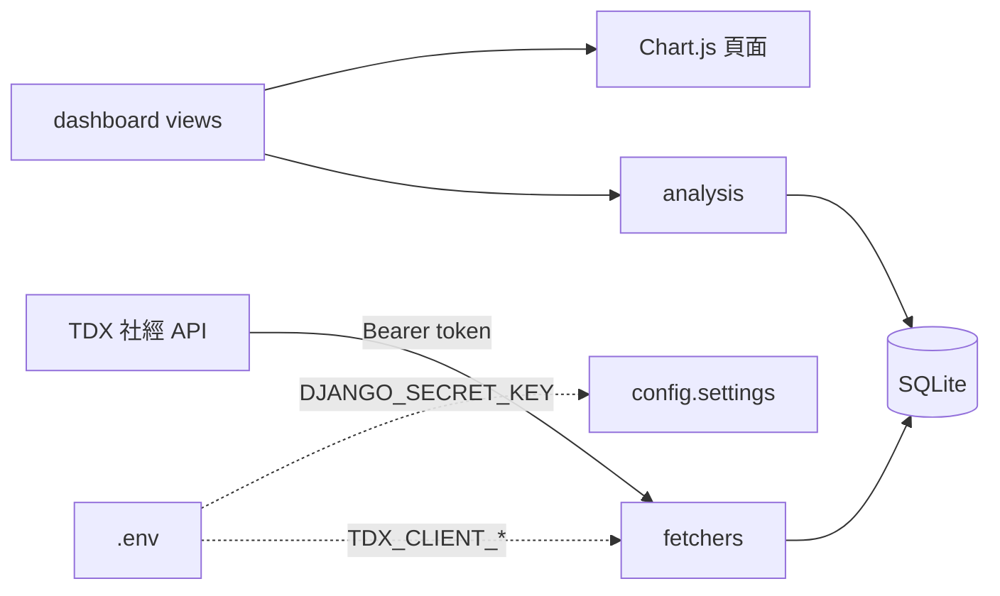

<p align="center">
  <a href="#readme"></a>
  <a href="docs/README.en.md"></a>
</p>

<p align="center">
  
</p>

<h1 align="center">TVIA</h1>

<p align="center">
  <strong>台灣車輛資訊分析網</strong><br>
  Taiwan Vehicle Information Analysis<br>
  用交通部 TDX 開放資料，看縣市車輛、家戶收入與大專學生怎麼疊在一起。
</p>

<p align="center">
  
  
  
  
  
  
  
</p>

<p align="center">
  <a href="#功能">功能</a> ·
  <a href="#示範">示範</a> ·
  <a href="#架構">架構</a> ·
  <a href="#安裝">安裝</a> ·
  <a href="#專案結構">結構</a> ·
  <a href="#貢獻">貢獻</a> ·
  <a href="docs/README.md">文件索引</a> ·
  <a href="CHANGELOG.md">變更紀錄</a>
</p>

---

各縣市有多少車、家戶收入往哪走、大專學生佔人口多少——這些數字本來散在交通部 TDX 的社經 API 裡。TVIA 把它們收進本機 SQLite，再用 Chart.js 做成四組對照圖：全國排行、時間序列成長、六都人均、學生結構。

> **現況。** 這是 2023 高科大 NKUST「Python 資料分析實務」第 10 組的繳交網站，2026 年才收成可公開的展示倉。分析口徑維持當年作業；金鑰、學號與作業草稿留在被忽略的 `original-data/`。示範資料到 2021–2023；要更新請自備 TDX 應用程式金鑰。

## 功能

<table>
<tr>
<td width="33%" valign="top">

### 全國車輛排行

最新一個有資料的年月，把 22 縣市的小客車、機車、大貨車、大客車或全部車種加總後排序。長條由深到淺，數量用千分位。

</td>
<td width="33%" valign="top">

### 成長對收入

2016 年起每年 12 月的車輛數，對上家戶收入合計（百萬元）。全國一張、六都各一張，雙軸折線。

</td>
<td width="33%" valign="top">

### 六都結構

人均月收入對每十萬人車輛；以及大專學生佔人口的比例，對小汽車／機車佔車輛的比例。年份取「收入／學生」與「人口」兩邊都有的較舊那一年，避免錯年對齊。

</td>
</tr>
</table>

| 還有這些 | 為什麼這樣做 |
| --- | --- |
| **資料來自 TDX，不爬網** | 家戶車輛、家戶收入、大專學生、鄉鎮人口都走交通部 Transport Data eXchange。 |
| **金鑰只在 `.env`** | 展示倉不把 TDX `client_id` 寫進程式或 SQLite。本機沒金鑰也能載入 `demo.json.gz` 看圖。 |
| **空庫有說明，不 500** | 沒載入資料時圖表頁會告訴你三條指令，而不是對空 queryset 取 `max()`。 |
| **後台不掛在導覽列** | Django admin 仍可用，但公開選單不再放 `/admin/`。 |

## 示範

課堂介紹影片（2023）：[TVIA 網站介紹](https://youtu.be/rJ5S1eBRaWs)

<p align="center">
  
</p>
<p align="center"><sub>首頁封面。點圖會開介紹影片。四張入口卡分別進排行、成長、收入、學生。</sub></p>

<p align="center">
  
</p>

| 圖表族 | 入口 |
| --- | --- |
| 全國排行 | `/rankings/`、`/rankings/car/`、`scooter`、`truck`、`bus` |
| 成長與收入 | `/growth/`、`/growth/taipei/` … `/growth/kaohsiung/` |
| 人均收入 | `/income/`、`/income/car/`、`/income/scooter/` |
| 學生比例 | `/students/car/`、`/students/scooter/` |

### 一條完整路徑

```text
複製 .env.example → .env（本機看圖可不填 TDX）
        ↓
python manage.py migrate
python manage.py loaddata data/fixtures/demo.json.gz
        ↓
python manage.py runserver
        ↓
瀏覽器開 http://127.0.0.1:8000/
        ↓
全國排行 → 六都成長 → 人均收入 → 學生比例
```

要改抓新資料：在 [TDX](https://tdx.transportdata.tw/) 申請應用程式，把 id/secret 填進 `.env`，再跑 `python manage.py fetch_tdx`。

## 架構



瀏覽器只打 Django。抓資料是管理指令，不是每次開頁就打 TDX。圖表數字由 `analysis/` 從資料庫聚合，views 不再複製六都各一份函式。

| 層 | 位置 | 責任 |
| --- | --- | --- |
| 設定 | `config/` | Django 專案；從 `.env` 讀密鑰 |
| 網頁 | `dashboard/` | 路由、模型、admin、管理指令 |
| 聚合 | `analysis/` | 排行、雙軸序列、六都比例 |
| 擷取 | `fetchers/` | TDX OAuth2 client-credentials |
| 展示文件 | `docs/` | 英文、架構、資料來源 |

<details>
<summary><strong>技術細節（可折疊）</strong></summary>

<br>

- 排行取 `VehicleCount` 最新的 `(year, month)`，不是 `Max(year)` 配 `Max(month)`（那會把 2023 配上別年的 12 月）。
- 「小汽車排行」只加 **小客車**；「收入對小汽車」加 **小客車 + 小貨車**。這是 2023 作業原口徑，不是疏漏。
- 家戶收入 `total` 的單位是百萬元；人均月收入 = `total × 1_000_000 / 人口 / 12`。
- 每十萬人車輛 = `車輛數 / 人口 × 100000`。
- TDX 多組金鑰用 `TDX_CLIENT_ID_2`、`TDX_CLIENT_SECRET_2` 輪詢，避免單一邊限。
- `import_legacy` 只讀 `original-data/python-10/db.sqlite3` 的資料表，**不複製** `mysite_tdx_api` 與 `auth_user`。
- 示範 fixture 約 22 000 筆、gzip 約 340 KB；不含金鑰與學號。

完整資料欄位見 [`docs/data-sources.md`](docs/data-sources.md)。模組邊界見 [`docs/architecture.md`](docs/architecture.md)。

</details>

## 安裝

需要 Python 3.10+。圖表頁不需 TDX 金鑰；`fetch_tdx` 才需要。

### 1. 環境

```powershell
python -m venv .venv
.\.venv\Scripts\Activate.ps1
pip install -r requirements.txt
Copy-Item .env.example .env
```

```bash
python -m venv .venv
source .venv/bin/activate
pip install -r requirements.txt
cp .env.example .env
```

至少把 `DJANGO_SECRET_KEY` 換成一串隨機字。本機 `DJANGO_DEBUG=true` 時若漏填，程式會用開發用占位（不能上線）。

### 2. 資料庫與示範資料

```powershell
python manage.py migrate
python manage.py loaddata data/fixtures/demo.json.gz
python manage.py runserver
```

瀏覽器開 <http://127.0.0.1:8000/>。

### 3. 自行抓 TDX（選擇性）

1. 到 [TDX 會員中心](https://tdx.transportdata.tw/) 建立應用程式，取得 Client Id / Client Secret。
2. 寫進 `.env` 的 `TDX_CLIENT_ID`、`TDX_CLIENT_SECRET`。
3. `python manage.py fetch_tdx`（或 `fetch_tdx vehicles` 等單一資料集）。

本機若還留著課程原料庫，也可以 `python manage.py import_legacy`，效果與載入 fixture 相同，同樣不會寫入金鑰。

## 專案結構

```text
config/                 Django 專案（settings / urls / wsgi）
dashboard/              模型、views、admin、管理指令
analysis/               圖表用聚合，不再 django.setup()
fetchers/               TDX 用戶端；憑證只從環境變數讀
templates/              首頁 + 四個圖表模板
static/                 封面、入口卡、favicon
data/fixtures/          不含密鑰的示範資料（gzip JSON）
docs/                   說明與 Hero；英文對照在 README.en.md
LICENSE                 MIT
CONTRIBUTING.md         貢獻約定
CHANGELOG.md            Keep a Changelog 2.0.0
original-data/          2023 作業原檔，已被 .gitignore
```

為什麼根目錄不再叫 `python-10`、以及哪些東西刻意沒上傳，見 [`docs/README.md`](docs/README.md)。

## 貢獻

這是封存的課程專案。歡迎修正文件與空狀態；請不要把 `original-data/` 或 `.env` 推進公開分支。細節在 [`CONTRIBUTING.md`](CONTRIBUTING.md)。

## 授權

程式與文件：[MIT](LICENSE) © 2023 [Lrniey666](https://github.com/Lrniey666)、[ejiru4u3](https://github.com/ejiru4u3)、[zhangkjim](https://github.com/zhangkjim)。

圖表數字來自交通部 [TDX](https://tdx.transportdata.tw/) 開放資料，授權依該平台條款。首頁插畫僅供重現當年網站外觀。

---

<p align="center">
  <sub>NKUST · Python 資料分析實務 · 第 10 組 · 2023</sub>
</p>
