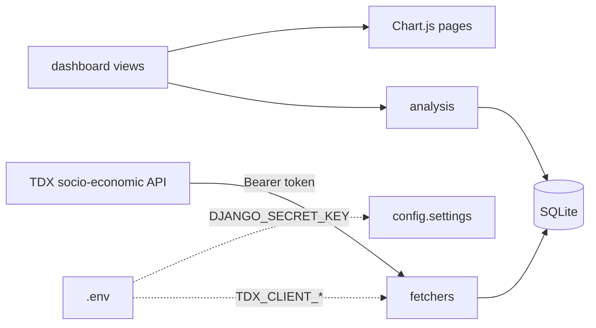

<div align="center">
  <a href="../README.md"></a>
  <a href="#readme"></a>
</div>

<div align="center">
  
</div>

<h1 align="center">TVIA</h1>

<div align="center">
  <strong>Taiwan Vehicle Information Analysis</strong><br>
  台灣車輛資訊分析網<br>
  Open TDX socio-economic data, charted as vehicles, household income, and university students.
</div>

<div align="center">
  
  
  
  
  
  
  
</div>

<div align="center">
  <a href="#features">Features</a> ·
  <a href="#demo">Demo</a> ·
  <a href="#architecture">Architecture</a> ·
  <a href="#installation">Installation</a> ·
  <a href="#project-structure">Structure</a> ·
  <a href="#contributing">Contributing</a> ·
  <a href="./README.md">Docs index</a> ·
  <a href="../CHANGELOG.md">Changelog</a>
</div>

---

How many vehicles each county keeps, where household income is going, and how large a share university students are of the population — those numbers already live in MOTC’s TDX socio-economic APIs. TVIA stores them in local SQLite and draws four Chart.js families: a national ranking, a growth-versus-income series, six-municipality per-capita bars, and a student-mix comparison.

English in this repository is **English**.

> **Status.** This is the 2023 NKUST *Python data-analysis practice* site from group 10, packaged for GitHub in 2026. The chart definitions stay as submitted. Keys, student numbers, and coursework drafts remain in the gitignored `original-data/` tree. The demo fixture covers 2021–2023; refresh it with your own TDX application credentials.

## Features

<table>
<tr>
<td width="33%" valign="top">

### National rankings

The latest month that has rows is summed across 22 counties for passenger cars, scooters, lorries, coaches, or every vehicle class. Bars fade from deep to light; counts use thousands separators.

</td>
<td width="33%" valign="top">

### Growth versus income

December vehicle counts from 2016, plotted against household-income totals (million TWD). One national chart and one per municipality, dual-axis lines.

</td>
<td width="33%" valign="top">

### Six-municipality structure

Monthly income per person against vehicles per 100 000 people; and the university-student share of population against the car/scooter share of the fleet. The year is the older of the two datasets so the axes line up.

</td>
</tr>
</table>

| Also | Why |
| --- | --- |
| **TDX, not scraping** | Household vehicles, household income, university students, and town-level population all come from Transport Data eXchange. |
| **Secrets only in `.env`** | The showcase never writes a TDX `client_id` into source or SQLite. Charts still run from `demo.json.gz` with no key. |
| **Empty stores do not 500** | Chart pages explain the three load commands instead of calling `max()` on an empty queryset. |
| **Admin is off the public nav** | Django admin still works; `/admin/` is no longer a menu item. |

## Demo

Course film (2023): [TVIA introduction](https://youtu.be/rJ5S1eBRaWs)

<div align="center">
  
</div>
<div align="center"><sub>Home cover. The image opens the film. Four cards lead to ranking, growth, income, and students.</sub></div>

<div align="center">
  
</div>

| Family | Paths |
| --- | --- |
| Rankings | `/rankings/`, `/rankings/car/`, `scooter`, `truck`, `bus` |
| Growth | `/growth/`, `/growth/taipei/` … `/growth/kaohsiung/` |
| Income | `/income/`, `/income/car/`, `/income/scooter/` |
| Students | `/students/car/`, `/students/scooter/` |

### One full path

```text
Copy .env.example → .env  (TDX keys optional for the demo)
        ↓
python manage.py migrate
python manage.py loaddata data/fixtures/demo.json.gz
        ↓
python manage.py runserver
        ↓
Open http://127.0.0.1:8000/
        ↓
Rankings → growth → income → students
```

To refresh live data, register an app on [TDX](https://tdx.transportdata.tw/), put the id/secret in `.env`, then run `python manage.py fetch_tdx`.

## Architecture



The browser talks only to Django. Ingest is a management command, not a per-page TDX call. Chart numbers are aggregated in `analysis/`; views no longer copy one function per city.

| Layer | Path | Role |
| --- | --- | --- |
| Settings | `config/` | Django project; secrets from `.env` |
| Site | `dashboard/` | Routes, models, admin, commands |
| Aggregation | `analysis/` | Rankings, dual-axis series, six-city ratios |
| Ingest | `fetchers/` | TDX OAuth2 client-credentials |
| Docs | `docs/` | English, architecture, data sources |

<details>
<summary><strong>Technical notes (collapsible)</strong></summary>

<br>

- Rankings use the latest `(year, month)` on `VehicleCount`, not `Max(year)` paired with `Max(month)`.
- The **car ranking** sums **private cars only** (`小客車`). Income-versus-car bars add **private cars + light goods** (`小客車 + 小貨車`). That is the 2023 definition, not an accident.
- Household income `total` is in million TWD. Monthly income per person = `total × 1_000_000 / population / 12`.
- Vehicles per 100 000 people = `count / population × 100000`.
- Extra TDX apps rotate through `TDX_CLIENT_ID_2` / `TDX_CLIENT_SECRET_2`.
- `import_legacy` reads `original-data/python-10/db.sqlite3` and **skips** `mysite_tdx_api` and `auth_user`.
- The demo fixture is about 22 000 rows, ~340 KB gzipped, with no keys or student numbers.

Field notes: [`data-sources.md`](data-sources.md). Module boundaries: [`architecture.md`](architecture.md).

</details>

## Installation

Python 3.10+ is enough. Chart pages do not need a TDX key; `fetch_tdx` does.

### 1. Environment

```powershell
python -m venv .venv
.\.venv\Scripts\Activate.ps1
pip install -r requirements.txt
Copy-Item .env.example .env
```

```bash
python -m venv .venv
source .venv/bin/activate
pip install -r requirements.txt
cp .env.example .env
```

Replace `DJANGO_SECRET_KEY` with a long random string. If it is missing while `DJANGO_DEBUG=true`, Django uses a development placeholder that must not be deployed.

### 2. Database and demo data

```powershell
python manage.py migrate
python manage.py loaddata data/fixtures/demo.json.gz
python manage.py runserver
```

Open <http://127.0.0.1:8000/>.

### 3. Fetch TDX (optional)

1. Create an application in the [TDX member centre](https://tdx.transportdata.tw/) and copy the Client Id / Client Secret.
2. Set `TDX_CLIENT_ID` and `TDX_CLIENT_SECRET` in `.env`.
3. Run `python manage.py fetch_tdx` (or a single dataset such as `fetch_tdx vehicles`).

If the 2023 working tree is still on disk, `python manage.py import_legacy` loads the same rows as the fixture and still ignores keys.

## Project structure

```text
config/                 Django project (settings / urls / wsgi)
dashboard/              models, views, admin, management commands
analysis/               chart aggregations; no django.setup()
fetchers/               TDX client; credentials from the environment only
templates/              home plus four chart templates
static/                 cover, entry cards, favicon
data/fixtures/          secret-free demo data (gzip JSON)
docs/                   notes and Hero; English lives here
LICENSE                 MIT
CONTRIBUTING.md         contribution rules
CHANGELOG.md            Keep a Changelog 2.0.0
original-data/          2023 coursework dump, gitignored
```

Why the root is no longer called `python-10`, and what was left out, is in [`README.md`](README.md) (this folder’s index).

## Contributing

This is archived coursework. Doc and empty-state fixes are welcome; do not push `original-data/` or `.env`. See [`CONTRIBUTING.md`](../CONTRIBUTING.md).

## Licence

Code and documentation: [MIT](../LICENSE) © 2023 [Lrniey666](https://github.com/Lrniey666), [ejiru4u3](https://github.com/ejiru4u3), [zhangkjim](https://github.com/zhangkjim).

Chart figures come from MOTC [TDX](https://tdx.transportdata.tw/) open data and remain under that platform’s terms. Cover artwork is only here to reproduce the 2023 site.

---

<div align="center">
  <sub>NKUST · Python data-analysis practice · group 10 · 2023</sub>
</div>
